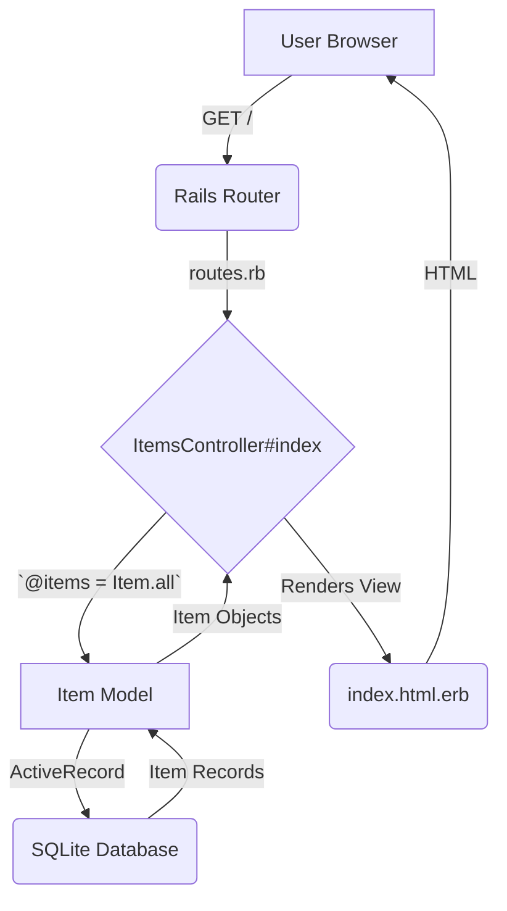

# Ruby on Rails: Item Lister

This project is a foundational learning application demonstrating the core Model-View-Controller (MVC) pattern in Ruby on Rails. It shows how to connect a Rails application to a database (SQLite), fetch records using a Model, handle a web request with a Controller, and render the data in a View.

## MVC Architecture Flow

This diagram illustrates how a user request flows through the MVC components in this application to render the list of items.



## Concepts Covered

*   **Rails MVC:** Understanding the separation of concerns between Models, Views, and Controllers.
*   **Active Record:** Using Rails' Object-Relational Mapper (ORM) to interact with the database (`Item.all`).
*   **Database Migrations:** Defining database schema in a versionable way.
*   **Data Seeding:** Populating the database with initial data (`db/seeds.rb`).
*   **Routing:** Mapping a URL to a controller action (`config/routes.rb`).
*   **ERB (Embedded Ruby):** Writing Ruby code within HTML templates to create dynamic content.
*   **Instance Variables:** Passing data from a controller to a view (e.g., `@items`).

## How to Run This Project

1.  **Clone the Repository:**
    ```bash
    git clone https://github.com/aastom/rails-item-lister.git
    cd rails-item-lister
    ```

2.  **Install Dependencies:**
    (Requires Ruby and Bundler to be installed)
    ```bash
    bundle install
    ```

3.  **Set Up the Database:**
    This command creates the SQLite database, runs the migrations to create the `items` table, and seeds the table with sample data.
    ```bash
    rails db:migrate db:seed
    ```

4.  **Run the Rails Server:**
    ```bash
    rails s
    ```

5.  **View in Browser:**
    Open your web browser and navigate to `http://localhost:3000`. You should see the list of items.

## Learning Journal: Key Decisions Explained

*   **What did `rails g model Item` accomplish?**
    It generated two key files: `app/models/item.rb`, which defines the `Item` object that interfaces with the database, and `db/migrate/..._create_items.rb`, which contains the instructions to create the `items` table in the database.

*   **What is the purpose of the `@` symbol in the controller's `@items` variable?**
    The `@` prefix creates an *instance variable*. In Rails, any instance variable set in a controller action is automatically made available to the corresponding view template. This is how we pass the list of items from `ItemsController` to `index.html.erb`.

*   **How does `config/routes.rb` connect a URL to the code?**
    The line `root 'items#index'` tells Rails to map the root URL of the application (`/`) to the `index` action within the `ItemsController`. When a request for `/` comes in, Rails knows exactly which piece of code to execute.

*   **What is the difference between SQLite and PostgreSQL?**
    At a high level, SQLite is a simple, file-based database that runs within the application, making it extremely easy for development. PostgreSQL is a powerful, standalone database server designed for production use, offering better scalability, concurrency, and data integrity. This project uses SQLite for ease of setup, but real applications typically use a database like PostgreSQL.

## References

*   [Ruby on Rails Guides](https://guides.rubyonrails.org/)
*   [Rails for Beginners](https://guides.rubyonrails.org/getting_started.html)
*   [Mermaid.js Documentation](https://mermaid-js.github.io/mermaid/#/)
